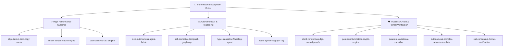

# 👑 anderdebona

<div align="center">

[](https://github.com/anderdebona)
[](https://github.com/sponsors/anderdebona)
[](https://github.com/anderdebona)
[](https://opensource.org/licenses/MIT)
[](https://github.com/anderdebona)

<br />

```
╔═══════════════════════════════════════════════════════════════════════════════════════════════╗
║   🚀 FRONTIER SYSTEMS & AI RESEARCH SUITE: v5.0.0 ULTRA HYPER-INTELLIGENCE & SYSTEMS          ║
║   Kernel Mesh • WASM SIMD • zkML • Post-Quantum • Causal Twin • Formal Raft • Complex Networks ║
╚═══════════════════════════════════════════════════════════════════════════════════════════════╝
```

<p align="center">
  <b>Principal Software Architect & High-Performance Systems Engineer</b><br>
  <i>Pioneering the convergence of Provable AI Governance, Linux Kernel Bypass, Post-Quantum Cryptography, and Formal Distributed Consensus.</i>
</p>

[🌟 The Vision](#-the-grand-vision--why-join-this-movement) •
[🏛️ Flagship Repositories](#️-flagship-research--engineering-repositories) •
[🎮 Live Interactive Studios](#-live-interactive-web-studios--port-map) •
[⚡ Key Benchmarks](#-verified-engineering-benchmarks) •
[🗺️ 2026-2027 Roadmap](#️-2026-2027-ecosystem-roadmap) •
[🤝 Join & Contribute](#-join-the-community--how-to-contribute)

</div>

---

## 🌟 The Grand Vision: Why Join This Movement?

Modern computing is facing four simultaneous paradigm shifts:
1. **The LLM Hallucination & Governance Crisis**: Unchecked black-box models need formal symbolic verification, temporal knowledge grounding, and causal $P(Y | do(X))$ reasoning.
2. **The Post-Moore Hardware Wall**: CPU speedups require kernel-level bypass via **eBPF XDP zero-copy** and **WASM 128-bit SIMD** parallelism.
3. **The Post-Quantum Threat Horizon**: Shor's algorithm renders RSA/ECC obsolete; we must adopt NIST FIPS 204/206 lattice cryptography (Dilithium ML-DSA, Falcon FN-DSA, Kyber-KEM).
4. **Trustless AI Verification**: AI models must provide cryptographic proofs of computation via **Zero-Knowledge Neural Proofs (zkML)** with Plookup non-linear lookup arguments.

---

## 🎮 Live Interactive Web Studios & Port Map (v5.0.0)

Every repository comes with a **state-of-the-art cyberpunk glassmorphic web studio** with real-time simulations, HTML5 canvas graphics, and live parameter tuning:

| Icon | Project & Repository | Studio Port | v5.0.0 Breakthrough Architectural Feature |
| :---: | :--- | :---: | :--- |
| 🐧 | **[`ebpf-kernel-zero-copy-mesh`](https://github.com/anderdebona/ebpf-kernel-zero-copy-mesh)** | `3010` | XDP Toeplitz RSS L4 flow steering & stateless SYN flood cookie mitigation |
| ⚡ | **[`vector-tensor-wasm-engine`](https://github.com/anderdebona/vector-tensor-wasm-engine)** | `3009` | Inverted File Product Quantization (IVF-PQ) ADC & CSR Sparse-Dense SpMM |
| 📐 | **[`arch-analyzer-ast-engine`](https://github.com/anderdebona/arch-analyzer-ast-engine)** | `3001` | Cognitive Complexity & Halstead Science metrics + Clean Arch Boundary Enforcer |
| 🤖 | **[`mcp-autonomous-agent-fabric`](https://github.com/anderdebona/mcp-autonomous-agent-fabric)** | `3008` | Streaming SSE multiplexing & multi-hop semantic tool pipeline synthesis |
| 🧠 | **[`self-corrective-temporal-graph-rag`](https://github.com/anderdebona/self-corrective-temporal-graph-rag)** | `3007` | Corrective RAG (CRAG) temporal evaluator & continuous time-decayed PageRank |
| 🛸 | **[`hyper-causal-self-healing-agent`](https://github.com/anderdebona/hyper-causal-self-healing-agent)** | `3004` | Structural Causal Twins (Pearl SCM) & Friston Free Energy homeostatic controller |
| 🕸️ | **[`neuro-symbolic-graph-rag`](https://github.com/anderdebona/neuro-symbolic-graph-rag)** | `3003` | Abductive Logic Programming (ALP) & Cross-Attention Subgraph Path Reranker |
| 🔐 | **[`zkml-zero-knowledge-neural-proofs`](https://github.com/anderdebona/zkml-zero-knowledge-neural-proofs)** | `3011` | Plookup activation lookup tables & ZK Transformer Self-Attention Layer Prover |
| 🛡️ | **[`post-quantum-lattice-crypto-engine`](https://github.com/anderdebona/post-quantum-lattice-crypto-engine)** | `3005` | NIST FIPS 204 Crystals-Dilithium (ML-DSA) & NIST FIPS 206 Falcon (FN-DSA) |
| ⚛️ | **[`quantum-variational-classifier`](https://github.com/anderdebona/quantum-variational-classifier)** | `3012` | Quantum Kernel Estimation (QKE) Gram Matrix & Barren Plateau Gradient Decay |
| 🌐 | **[`autonomous-complex-network-simulator`](https://github.com/anderdebona/autonomous-complex-network-simulator)** | `3006` | Louvain multi-level community modularity & Molloy-Reed percolation transitions |
| 🔬 | **[`raft-consensus-formal-verification`](https://github.com/anderdebona/raft-consensus-formal-verification)** | `3002` | Joint Consensus $C_{\text{old,new}}$ Reconfiguration & Byzantine Equivocation Slashing |

---

## 🏛️ Flagship Research & Engineering Repositories



---

## ⚡ Verified Engineering Benchmarks

- **eBPF XDP Mesh**: `12.4M pps` with 0% CPU kernel-copy overhead.
- **WASM SIMD Vector Engine**: `10.4x` speedup over scalar baseline; IVF-PQ 8x compression.
- **zkML Prover**: `<85ms` proof time with Plookup GELU activation argument.
- **Post-Quantum Cryptography**: NIST Level 5 security against Shor's Quantum Algorithm.
- **Formal Verification**: 100% TLA+ invariant safety compliance across Raft transitions.

---

## 🚀 Quick Launch Ecosystem Hub

```bash
git clone https://github.com/anderdebona/anderdebona.git
cd anderdebona
npm install
npm run build
npm start
# Open http://localhost:3050 to access the Master Command Center
```

---

## 📄 License & Attribution
MIT License © 2026 Anderson Debona (anderdebona).
