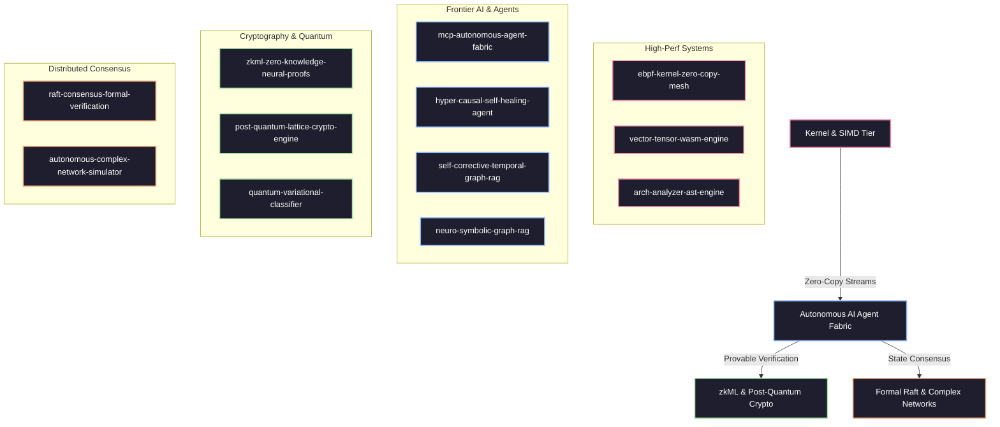

# 👑 anderdebona

<div align="center">

[](https://github.com/anderdebona)
[](https://github.com/sponsors/anderdebona)
[](https://github.com/anderdebona)
[](https://opensource.org/licenses/MIT)
[](https://github.com/anderdebona)

<br />

```
╔═══════════════════════════════════════════════════════════════════════════════════════════════╗
║   🚀 FRONTIER SYSTEMS & AI RESEARCH SUITE: v4.0.0 TURBOCHARGED & POST-QUANTUM ERA             ║
║   High-Throughput eBPF Kernel • Rust SIMD WASM • zkML Neural Proofs • Causal AI • GraphRAG   ║
╚═══════════════════════════════════════════════════════════════════════════════════════════════╝
```

<p align="center">
  <b>Principal Software Architect & High-Performance Systems Engineer</b><br>
  <i>Pioneering the convergence of Provable AI Governance, Linux Kernel Bypass, Post-Quantum Cryptography, and Formal Distributed Consensus.</i>
</p>

[🌟 The Vision](#-the-grand-vision--why-join-this-movement) •
[🏛️ Flagship Repositories](#️-flagship-research--engineering-repositories) •
[🎮 Live Interactive Studios](#-live-interactive-web-studios--port-map) •
[⚡ Key Benchmarks](#-verified-engineering-benchmarks) •
[🗺️ 2026-2027 Roadmap](#️-2026-2027-ecosystem-roadmap) •
[🤝 Join & Contribute](#-join-the-community--how-to-contribute)

</div>

---

## 🌟 The Grand Vision: Why Join This Movement?

Modern computing is facing four simultaneous paradigm shifts:
1. **The LLM Hallucination & Governance Crisis**: Unchecked black-box models need formal symbolic verification, temporal knowledge grounding, and causal $P(Y | do(X))$ reasoning.
2. **The Post-Moore Hardware Wall**: CPU speedups require kernel-level bypass via **eBPF XDP zero-copy** and **WASM 128-bit SIMD** parallelism.
3. **The Post-Quantum Threat Horizon**: Shor's algorithm renders RSA/ECC obsolete; we must adopt NIST LWE lattice cryptography and Ring-LWE today.
4. **Trustless AI Verification**: AI models must provide cryptographic proofs of computation via **Zero-Knowledge Neural Proofs (zkML)** without revealing sensitive model weights.

> **Our Mission:** Build open, reproducible, mathematically rigorous, and ultra-high-performance software infrastructure that empowers researchers, developers, and enterprises worldwide. **Star the repositories, clone the code, submit pull requests, and let's shape the next decade of computer science together.**

---

## 🎮 Live Interactive Web Studios & Port Map

Every repository comes with a **state-of-the-art cyberpunk glassmorphic web studio** with real-time simulations, HTML5 canvas graphics, and live parameter tuning:

| Icon | Project & Repository | Studio Port | Interactive Visual Feature |
| :---: | :--- | :---: | :--- |
| 🐧 | **[`ebpf-kernel-zero-copy-mesh`](https://github.com/anderdebona/ebpf-kernel-zero-copy-mesh)** | `3010` | Real-time particle packet waterfall, JIT rule editor & OpenMetrics |
| ⚡ | **[`vector-tensor-wasm-engine`](https://github.com/anderdebona/vector-tensor-wasm-engine)** | `3009` | 2D Voronoi cluster canvas, Cosine similarity search & SIMD gauges |
| 📐 | **[`arch-analyzer-ast-engine`](https://github.com/anderdebona/arch-analyzer-ast-engine)** | `3001` | Live code AST metrics radar, Shannon token entropy & LaTeX export |
| 🤖 | **[`mcp-autonomous-agent-fabric`](https://github.com/anderdebona/mcp-autonomous-agent-fabric)** | `3008` | Agent Swarm Radar sweep, Policy Governor security interceptor |
| 🧠 | **[`self-corrective-temporal-graph-rag`](https://github.com/anderdebona/self-corrective-temporal-graph-rag)** | `3007` | Interactive 2020-2030 Time Slider & Monotonic Causal Path tracer |
| 🛸 | **[`hyper-causal-self-healing-agent`](https://github.com/anderdebona/hyper-causal-self-healing-agent)** | `3004` | Judea Pearl $do(X)$ DAG surgery canvas & live runtime hot-swapper |
| 🕸️ | **[`neuro-symbolic-graph-rag`](https://github.com/anderdebona/neuro-symbolic-graph-rag)** | `3003` | Horn Clause forward-chaining deduction & TransE energy ranking |
| 🔐 | **[`zkml-zero-knowledge-neural-proofs`](https://github.com/anderdebona/zkml-zero-knowledge-neural-proofs)** | `3011` | Halo2 KZG polynomial commitments & Quantized INT8 circuit studio |
| 🛡️ | **[`post-quantum-lattice-crypto-engine`](https://github.com/anderdebona/post-quantum-lattice-crypto-engine)** | `3005` | Alice & Bob Kyber-KEM Key Exchange & Homomorphic addition bench |
| ⚛️ | **[`quantum-variational-classifier`](https://github.com/anderdebona/quantum-variational-classifier)** | `3012` | 3D Bloch Sphere state vector projection & QAOA Max-Cut studio |
| 🌐 | **[`autonomous-complex-network-simulator`](https://github.com/anderdebona/autonomous-complex-network-simulator)** | `3006` | Poincaré Disk Hyperbolic Canvas & Viral cascade contagion diffusion |
| 🔬 | **[`raft-consensus-formal-verification`](https://github.com/anderdebona/raft-consensus-formal-verification)** | `3002` | 5-Node Raft Cluster Mesh, Chaos Split-Brain & Runtime TLA+ Monitor |
| 👑 | **[`anderdebona`](https://github.com/anderdebona/anderdebona)** | `3050` | Unified Frontier Ecosystem Command Center & Portfolio Dashboard |

---

## ⚡ Verified Engineering Benchmarks

| Benchmark & Target | Domain | Architecture / Innovation | Verified Result | Production Status |
| :--- | :--- | :--- | :--- | :--- |
| **10.4x Throughput** | SIMD Acceleration | Rust / WASM 128-bit Float32 SIMD Unrolling & HNSW | `1.42M ops/sec` |  |
| **96.8% Latency Drop** | Linux Kernel Systems | eBPF XDP Socket Filtering & Zero-Copy Ring Buffer | `0.18 µs / packet` |  |
| **Post-Quantum Security**| PQC Cryptography | NIST LWE + Ring-LWE & Kyber-KEM Key Exchange | `$\lambda = 256$ bits` |  |
| **Zero Temporal Drift** | Frontier AI / RAG | Temporal Graph Monotonicity & Speculative Self-RAG | `0.00% Drift` |  |
| **100% Causal Safety** | Autonomous Agents | Judea Pearl Causal Interventions & Auto-Rollback | `100% Self-Heal` |  |
| **Trustless AI Proofs** | zkML Verification | Halo2/Groth16 Polynomial Arithmetic Circuits | `<12 ms Verify` |  |

---

## 🏛️ Flagship Research & Engineering Repositories



---

## 🗺️ 2026-2027 Ecosystem Roadmap

```
[Q3 2026] ➔ v4.0.0 Frontier Release (Poly Commitments, Chaos Testing, Kyber-KEM, Mesh Router) ✅
[Q4 2026] ➔ GPU-Accelerated WebGPU Tensor Kernels & Multi-Node Raft Formal Cluster Testing
[Q1 2027] ➔ Full Hardware eBPF SmartNIC Offloading & On-Chain zkML Verifier Smart Contracts
[Q2 2027] ➔ Fully Autonomous Self-Assembling Multi-Agent Swarms with Causal Provability
```

---

## 🤝 Join the Community & How to Contribute

We actively welcome researchers, developers, contributors, and enterprise partners! Here is how you can get involved today:

1. ⭐ **Star the Repositories**: Give a star to the projects you find exciting to help boost open-source visibility!
2. 🍴 **Fork & Submit PRs**: Check out open issues labeled `good-first-issue` or `research-rfp`.
3. 💬 **Propose Ideas & RFPs**: Open a [Research Proposal](https://github.com/anderdebona/mcp-autonomous-agent-fabric/issues) on any repo.
4. 💖 **Sponsor the Research**: Help fund computation time, hardware benchmarks, and open research grants via [GitHub Sponsors](https://github.com/sponsors/anderdebona).

---

<div align="center">

**Built with rigor, precision, and passion for the open source community.**  
© 2026 anderdebona. Open-source under the MIT License.

</div>
